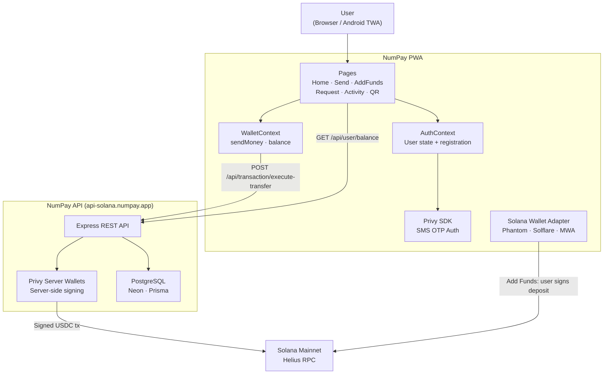
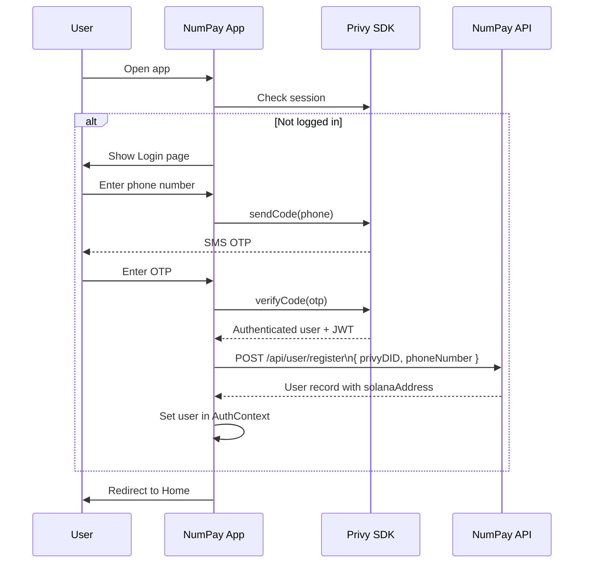
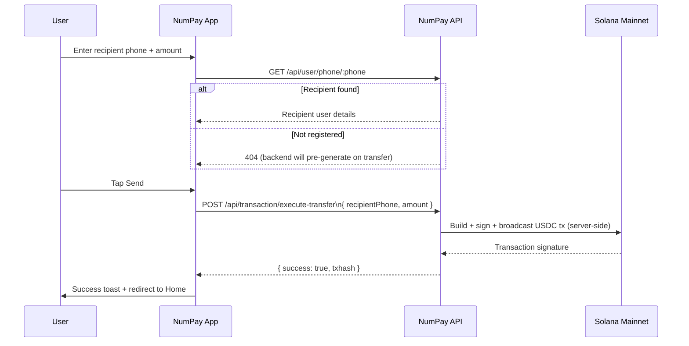
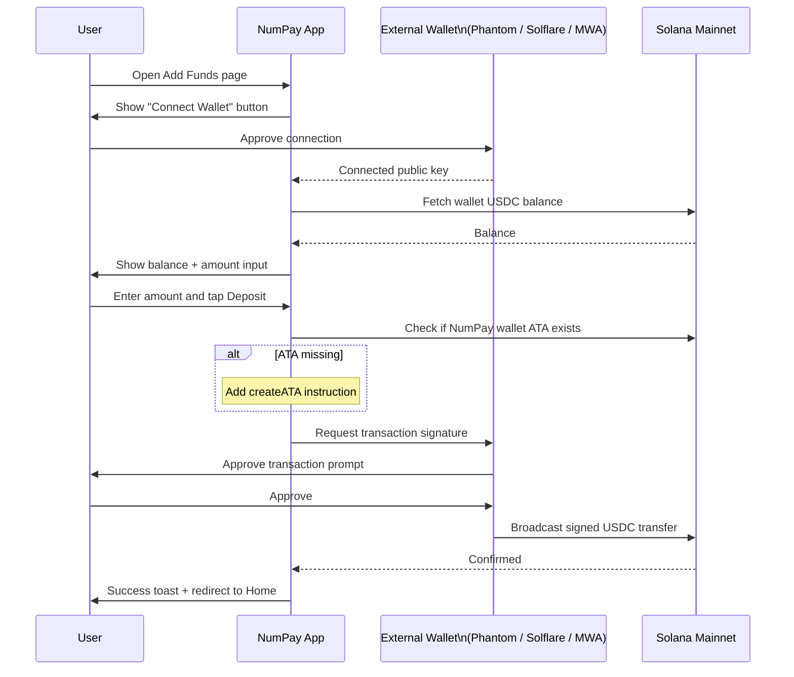

# NumPay Dapp

Progressive Web App (PWA) frontend for NumPay — send and receive USDC on Solana using just a phone number. No crypto knowledge required.

---

## Tech Stack

| Layer | Technology |
|---|---|
| Framework | React 18 + TypeScript |
| Build tool | Vite + SWC |
| Styling | Tailwind CSS + shadcn/ui (Radix UI) |
| Auth | Privy (`@privy-io/react-auth`) — SMS OTP |
| Blockchain | Solana Mainnet via `@solana/web3.js` |
| Wallet adapter | `@solana/wallet-adapter-react` + Solana MWA |
| State | TanStack Query |
| Routing | React Router v6 |
| PWA | `vite-plugin-pwa` (installable, offline-ready) |

---

## Features

- **Phone-number payments** — send USDC to any phone number; recipient gets a wallet automatically
- **SMS login** — no passwords, no seed phrases; authenticate via Privy OTP
- **Add funds** — connect an external Solana wallet (Phantom, Solflare, or MWA on Android) and deposit USDC
- **QR code payments** — share a QR code to receive payments instantly
- **Payment requests** — request money from contacts with an optional message
- **Activity feed** — full transaction history with status tracking
- **PWA / installable** — works as a standalone app on Android and iOS
- **Solana dApp Store ready** — Solana Mobile Wallet Adapter (MWA) integration for TWA submission

---

## Architecture



---

## Frontend Flow

### Authentication Flow



### Send Money Flow



### Add Funds Flow



---

## Getting Started

### Prerequisites

- Node.js 18+ or Bun 1.0+
- NumPay backend running (see [backend repo](https://github.com/numpayapp/Numpay/tree/backend))

### Installation

```bash
git clone https://github.com/numpayapp/Numpay.git -b frontend
cd frontend
npm install
# or
bun install
```

### Environment Variables

Create a `.env` file in the project root:

```env
# Firebase
VITE_APP_FIREBASE_API_KEY=your_firebase_api_key
VITE_APP_FIREBASE_AUTH_DOMAIN=your_project.firebaseapp.com
VITE_APP_FIREBASE_PROJECT_ID=your_project_id
VITE_APP_FIREBASE_STORAGE_BUCKET=your_project.firebasestorage.app
VITE_APP_FIREBASE_MESSAGING_SENDER_ID=your_sender_id
VITE_APP_FIREBASE_APP_ID=your_app_id

# Privy
VITE_APP_PRIVY_APP_ID=your_privy_app_id
VITE_APP_PRIVY_CLIENT_ID=your_privy_client_id

# Backend API
VITE_BASE_URL=http://localhost:3001

# Solana RPC (Helius recommended)
VITE_SOLANA_RPC_URL=https://mainnet.helius-rpc.com/?api-key=YOUR_KEY
```

### Run

```bash
# Development
npm run dev

# Production build
npm run build

# Preview production build
npm run preview
```

App runs at `http://localhost:5173`.

---

## Project Structure

```
src/
├── components/          # Shared UI components
│   ├── ui/              # shadcn/ui primitives (Button, Card, Dialog, etc.)
│   ├── Header.tsx
│   ├── AmountInput.tsx
│   └── Layout.tsx
├── context/
│   ├── AuthContext.tsx            # Privy auth state + user registration
│   ├── WalletContext.tsx          # App-level wallet state + sendMoney logic
│   └── SolanaWalletProvider.tsx   # Solana wallet adapter (MWA + extensions)
├── hooks/
│   └── use-balance.ts             # USDC balance polling hook
├── pages/
│   ├── Home.tsx                   # Dashboard — balance + quick actions
│   ├── AddFunds.tsx               # Connect external wallet + USDC deposit
│   ├── SendMoney/Send.tsx         # Send USDC by phone number
│   ├── RequestMoney/              # Create and share payment requests
│   ├── Activity.tsx               # Transaction history
│   ├── QRCode.tsx                 # QR code for receiving
│   ├── Login.tsx                  # SMS OTP login
│   └── Settings/                  # Account, security, support settings
├── lib/
│   └── utils.ts                   # cn(), showError(), showSuccess()
└── App.tsx                        # Router + provider tree
```

---

## Wallet Adapter Setup

The app supports three wallet connection modes simultaneously:

| Adapter | Use case |
|---|---|
| `SolanaMobileWalletAdapter` | Android TWA / Solana dApp Store |
| `PhantomWalletAdapter` | Browser extension (desktop / iOS) |
| `SolflareWalletAdapter` | Browser extension (desktop / iOS) |

The `SolanaWalletProvider` wraps the entire app and exposes `useWallet` / `useConnection` hooks throughout.

---

## PWA Configuration

The app is configured as a full PWA via `vite-plugin-pwa`:

- **Install prompt** — users can install NumPay as a standalone app on Android and iOS
- **Auto-update** — service worker updates automatically on new deployments
- **Offline support** — core assets cached via Workbox
- **Icons** — full Android launcher icon set at `/public/AppImages/android/`
